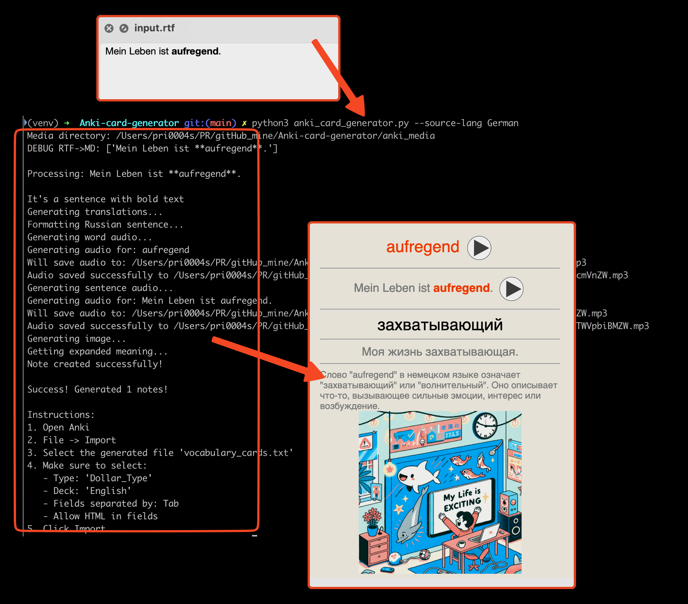

# Anki Card Generator

A script for automatically generating Anki cards from a markdown file with bold-highlighted words/phrases. Cards are added to your existing "English" deck using "Dollar_Type" note type.

## Features

- Creates Anki cards from a markdown file
- Automatically translates words and sentences to Russian
- Generates audio pronunciation for words and sentences using OpenAI TTS
- Creates images for sentences using DALL-E 3
- Adds expanded word explanations in Russian
- Generates a ready-to-import .txt file with all media included
- Uses your existing Anki note type and deck

## Card Structure

Each card contains the following fields:
1. Foreign - English word/phrase (bold-highlighted or entire sentence)
2. Foreign Sentence - original sentence with orange highlighting
3. Russian - translation of the word/phrase to Russian (shortest possible translation)
4. Russian Sentence - translation of the sentence to Russian with bold word
5. Audio - audio pronunciation of the word/phrase
6. Audio Sentence - audio pronunciation of the sentence
7. Expanded Meaning - extended explanation in Russian
8. Image - generated image using DALL-E 3
9. Url - (empty)
10. frequencies - (empty)
11. Tags - "openAPI" tag

## Requirements

- Python 3.x
- OpenAI API key
- Anki installed with "Dollar_Type" note type and "English" deck
- Required Python packages. For macOS users:
```bash
  # Create a virtual environment (recommended for macOS)
  python3 -m venv venv
  source venv/bin/activate
  
  # Install required packages
  python3 -m pip install openai requests tqdm
```

## Installation

1. Clone the repository:
```bash
git clone [repository url]
cd Anki-card-generator
```

2. Set up your OpenAI API key (choose one method):
   - Set environment variable: `export OPENAI_API_KEY='your-api-key-here'`
   - Or provide it directly when running the script

## Usage

1. Create an `input.md` file with sentences where target words are in bold:
```markdown
I'll give our **daughter** a ride
She was **kind** and polite
```

2. Run the script:
```bash
# If OPENAI_API_KEY is set in environment:
python3 anki_card_generator.py --input input.md

# With media generation (images and audio):
python3 anki_card_generator.py --input input.md --generate-media

# Or with explicit API key:
python3 anki_card_generator.py --api-key 'your-api-key-here' --input input.md
```

3. Import the generated cards:
   - Open Anki
   - File -> Import
   - Select the generated `vocabulary_cards.txt` file
   - Make sure to select:
     - Type: 'Dollar_Type'
     - Deck: 'English'
     - Fields separated by: Tab
     - Allow HTML in fields
   - Click Import

4. Result in Anki:


## Project Structure

- `anki_card_generator.py` - main script
- `input.md` - input file with sentences
- `anki_media/` - folder for media files (images and audio)
- `vocabulary_cards.txt` - generated import file

## Notes

- The script uses OpenAI API for:
  - Translations (GPT-4)
  - Image generation (DALL-E 3, 1024x1024)
  - Audio generation (TTS-1, alloy voice)
- All media files are saved in `anki_media/` directory
- Uses your existing Anki note type and deck structure
- Media generation is optional and disabled by default

## Troubleshooting

1. If you see module import errors:
   ```bash
   # Check if required packages are installed:
   pip list | grep -E "openai|tqdm|requests"
   
   # Install missing packages:
   pip install openai requests tqdm
   ```

2. If the import doesn't work:
   - Verify you have "Dollar_Type" note type in Anki
   - Make sure "English" deck exists
   - Check that all fields match exactly

3. If media files are missing:
   - Check the `anki_media/` directory exists
   - Verify the files were generated successfully
   - Make sure to copy media files to Anki's collection.media folder

4. If API calls fail:
   - Verify your API key is valid
   - Check your OpenAI account has sufficient credits

## License

MIT 